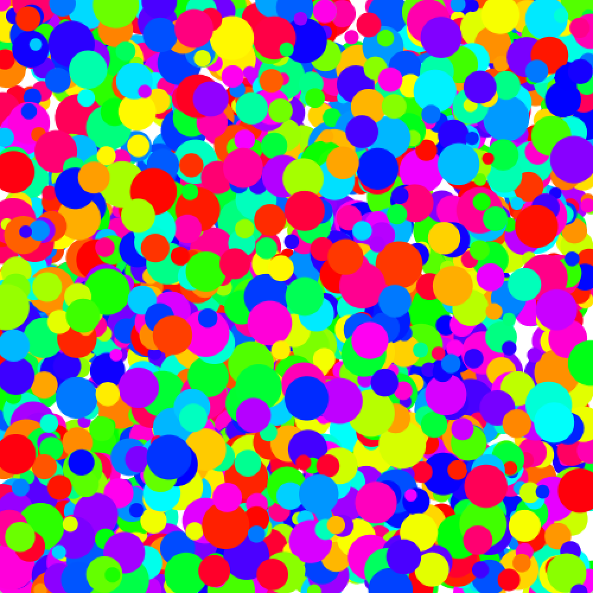
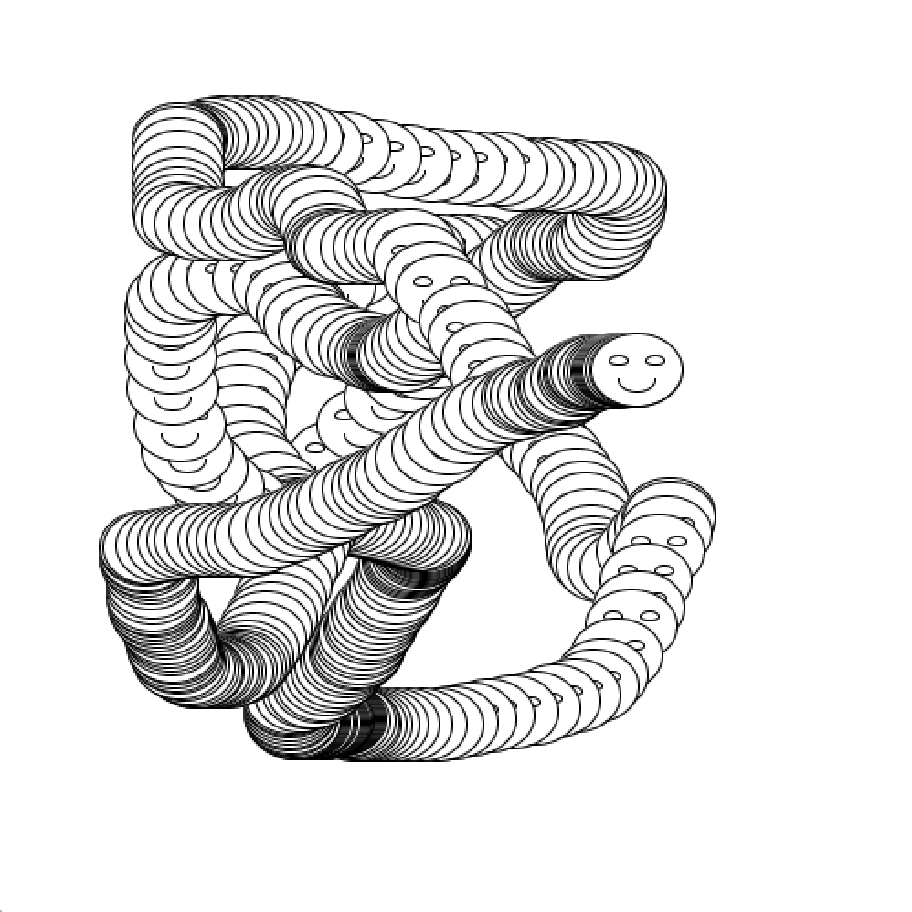
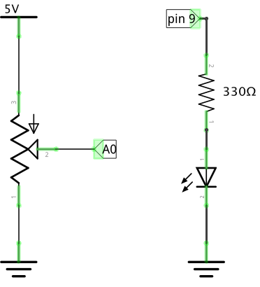
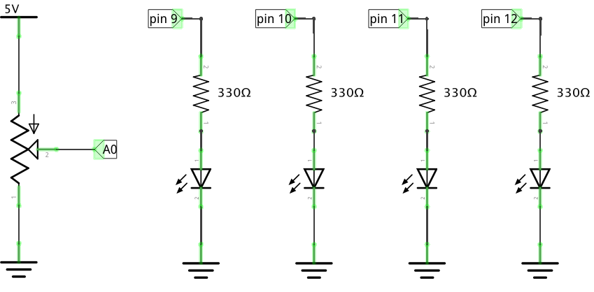
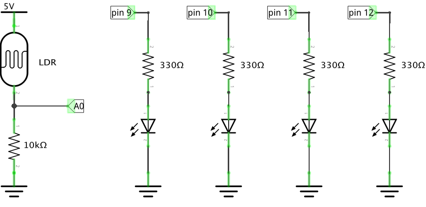
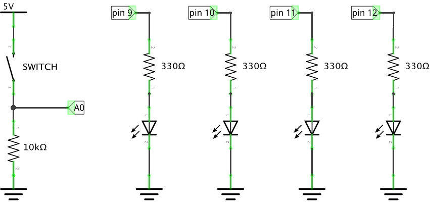
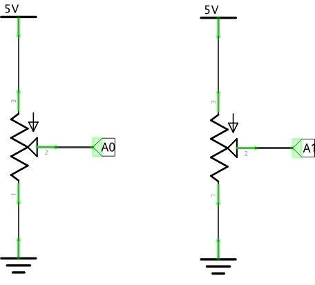

# CCA Programming & Electronics, Spring  2016

This course repository contains homework assignments, useful guides, and code for "Programming & Electronics" at CCA, Spring 2016.

Also included in this repository is the official [course syllabus](syllabus.pdf).

### Week 1: Monday, January 25, 2016

Lecture:
- Inspirational Videos
- Introductions
- What is programming?
- Goals & course details

Hands-on activities:
- Human Embodiment of Programmer & Robot
  - Programs generally run line-by-line.
  - While loops, if statements, and functions break that up.

Videos:
- Basic robots
  - [Coffee-can robot](http://www.youtube.com/watch?v=b0mIshBIbvI#t=24)
  - [Tree-climbing robot](http://www.youtube.com/watch?v=zkpH1BjD6Wc)
  - [Self-balancing robot](http://www.youtube.com/watch?v=Tw9Jr-SPL0Y)
  - [Insect robot](http://www.youtube.com/watch?v=tOsNXg2vAd4#t=120)
  - [Treadbot](http://www.youtube.com/watch?v=YblSltHDbIU)
  - [Velociraptor robot](http://www.youtube.com/watch?v=lPEg83vF_Tw)
- Installations
  - [The Bay Lights](http://thebaylights.org/)
  - [Murmur Wall](http://www.future-cities-lab.net/projects/#/murmurwall/)
  - [Floating Couch](http://vimeo.com/72826106)
  - [Wooden Segment Mirror](https://www.youtube.com/watch?v=BZysu9QcceM#t=36)
  - [Generative design](https://www.youtube.com/watch?v=pNkz8wEJljc)
- Art & Music bots
  - [Textile weaving](https://vimeo.com/71044541)
  - [ReacTable](https://www.youtube.com/user/marcosalonso)
  - [Projection mapping](https://www.youtube.com/watch?v=czuhNcNU6qU)
  - [Laser harp](http://www.youtube.com/watch?v=sLVXmsbVwUs#t=20)
  - [Cubli: Floating Cube](https://www.youtube.com/watch?v=n_6p-1J551Y)
  - [Arc-o-matic](http://vimeo.com/57082262#at=130)
  - [Robo Faber](http://vimeo.com/78771257)
  - [Eggbot](https://www.youtube.com/watch?v=w4cdbV2oaEc)
- Drink-makers
  - [Textspresso](http://www.youtube.com/watch?v=kx9D74t7GD8#t=89)
  - [The Inebriator](http://www.youtube.com/watch?v=WqY7fchs7H0)
- Computer Numerical Control (CNC)
  - [Shapoko / tinyg](http://www.youtube.com/watch?v=pCC1GXnYfFI#t=11)
  - [Makerbot Replicator](http://www.youtube.com/watch?v=NAbiAzYhTOQ)
- Vacuuming
  - [Roomba](https://www.youtube.com/watch?v=0DNkbZvVYvc)

[Homework for Week 1](hw/week1.md)

### Week 2: Monday, February 1, 2016

Lecture:
- Homework Review

Lab:
#### Sketching with Processing

1.  Rewrite the following code without using a loop:

    ```processing
    size(200, 200);
    background(255);

    int i = 0;
    while (i < 7) {
      line(10+i*30, 10, 10+i*30, height-10);
      i = i + 1;
    }
    ```

2.  Rewrite the following code using a `while` or `for` loop:

    ```processing
    size(200, 200);
    background(255);

    line(10, 10, 20, 10);
    line(20, 20, 30, 20);
    line(30, 30, 40, 30);
    line(40, 40, 50, 40);
    line(50, 50, 60, 50);
    line(60, 60, 70, 60);
    line(70, 70, 80, 70);
    line(80, 80, 90, 80);
    line(90, 90, 100, 90);
    line(100, 100, 110, 100);
    line(110, 110, 120, 110);
    line(120, 120, 130, 120);
    line(130, 130, 140, 130);
    line(140, 140, 150, 140);
    line(150, 150, 160, 150);
    line(160, 160, 170, 160);
    line(170, 170, 180, 170);
    line(180, 180, 190, 180);
    ```

3.  Rewrite the following code without using the `house` function:

    ```processing
    void setup() {
      size(200, 200);
      background(255);
    }

    void house(int x, int y) {
      rect(x, y, 20, 20);
      line(x, y, x+10, y-10);
      line(x+10, y-10, x+20, y);
    }

    void draw() {
      background(255);
      house(mouseX-10, mouseY-10);
    }
    ```

4.  Modify the following code so that clicking clears the screen. One way to do this is to add a `mousePressed` function; the Processing reference on [mousePressed()](https://processing.org/reference/mousePressed_.html) may be useful.

    ```processing
    void setup() {
      size(200, 200);
      background(255);
    }

    void draw() {
      line(pmouseX, pmouseY, mouseX, mouseY);
    }
    ```

#### Recreating Sketches

1. 

2. 

3. 

4. [](http://www.youtube.com/watch?v=jWNXFlGHuPA)

5. 

6. Look through the [Processing reference](http://processing.org/reference). Pick a function, and use it in a new sketch of your own choosing.

[Homework for Week 2](hw/week2.md)

### Week 3: Monday, February 8, 2016

Lecture:
- Homework Review

Lab:
- Deep dive on loops, including variables and conditions.

[Homework for Week 3](hw/week3.md)

### Week 4: Monday, February 15, 2016

1. Homework Review

2. Evaluating Code.
   - Code Tracing Exercise [PDF](code-tracing.pdf)
   - Learning about Program Evaluation - [PDF of slides](program-evaluation.pdf)
   - Debugging with `println`!
     -  Practice One. What's the last value of `i` here? Calculate it manually, then confirm with a `println`.
        
        ```processing
        int i = 7;
        while (i < 95) {
          line(i, random(height), i, random(height));
          i = i + 7;
        }
        ```
     -  Practice Two. What's the last value of `j` here? `counter`? How many times does a `rect` get drawn? Calculate manually, then confirm with `println`.
        
        ```processing
        int i = 5;
        int j = 10;
        int counter = 0;
        while (i < 97) {
          j = 10;
          while (j < 97) {
            rect(5+i/2, 5+j/2, 3, 3);
            counter = counter + 1;

            j = j + 10;
          }
          i = i + 5;
        }
        ```
     -  Buggy One. Should draw a grid of circles. Doesn't.
        ```processing
        size(400, 400);
        background(255);

        int i = 0;
        int j = 0;

        while (i < 24) {
          j = 0;
          while (j < 24) {
            int x = 20 + i*15;
            int y = 20 + i*15;
            ellipse(x, y, 10, 10);
            j++;
          }
          i++;
        }
        ```
       
     -  Buggy Two. Should bounce an ellipse around the screen. Doesn't.
        ```processing
        float radius = 5;
        
        // ellipse position
        float x1 = 30;
        float y1 = 40;

        // ellipse velocity
        float vx1 = 1.7;
        float vy1 = -1;

        void setup() {
          size(200, 200);
          background(255);
        }

        void draw() {
          background(255);

          // switch velocity direction if it's out of bounds
          if (x1 < radius) {
            vx1 = abs(vx1);
          }
          if (x1 > width-radius) {
            vx1 = -abs(vx1);
          }
          if (y1 < radius) {
            vy1 = abs(vy1);
          }
          if (y1 > height-radius) {
            vy1 = abs(vy1);
          }

          // update position
          x1 += vx1;
          y1 += vy1;

          // draw the ellipse itself
          ellipse(x1, y1, radius*2, radius*2);
        }
        ```

3. Arrays

[Homework for Week 4](hw/week4.md)

### Week 5: Monday, February 22, 2016

1. Homework Review

2. Flappy Bird!
   
   The code for [flappy.pde](hw/flappy.pde) in [homework 4](hw/week4.pde) takes random lines of random height and sends them towards the left edge of the screen. This is *almost* the mobile phone game [Flappy Bird](https://www.youtube.com/watch?v=fQoJZuBwrkU)!
   
   What's missing? At least a few things. In today's class, your assignment will be to build up Flappy Bird (or something like it) starting from the base code at [flappy.pde](hw/flappy.pde).
   
   Do the following:
   
   -  Lines only go up from the bottom — there’s no corresponding line from top as well. Add one!
   -  Add the actual bird! Start with an `ellipse`, but ideally it ends up something nice-looking?
   -  Make the actual bird move with the keyboard. Check out the `keyPressed` variable.
   -  Slow everything down.
   -  Detect collisions with the walls.
   -  Space out the walls more, so you can be guaranteed to go from wall opening to wall opening.
   -  Make everything pretty!
  
  
[Homework for Week 5](hw/week5.md)

### Week 6: Monday, February 29, 2016

1. Homework Review: understanding Flappy Bird and Snake.

2. Syntax Review: understanding the syntax of variables, loops, conditions, and functions.

3. Breaking down a puzzle into steps you can implement. More on this in the homework!

[Homework for Week 6](hw/week6.md)

### Week 7: Monday, March 7, 2016

1. Homework Review: bouncing a circle across the canvas. We reviewed:
   -  A single ball bouncing around the canvas:
      ```processing
      float x;
      float y;
      float radius;
      float xSpeed;
      float ySpeed;

      void setup() {
        size(500, 500);
        background(255);
  
        radius = 10;
  
        x = width/2;
        y = height/2;
  
        xSpeed = 3;
        ySpeed = 4;
      }

      void draw() {
        background(255);
  
        fill(255, 0, 0);
        noStroke();
        ellipse(x, y, radius*2, radius*2);
  
        x = x + xSpeed;
        y = y + ySpeed;
  
        if (x - radius < 0 || x + radius > width) {
          xSpeed = -xSpeed;
        }
        if (y - radius < 0 || y + radius > height) {
          ySpeed = -ySpeed;
        }
      }
      ```
   -  A single ball, using a class called `Ball`:
      ```processing
      class Ball {
        float x;
        float y;
        float radius;
        float xSpeed;
        float ySpeed;

        void move() {
          x = x + xSpeed;
          y = y + ySpeed;
        }

        void display() {
          fill(255, 0, 0);
          noStroke();
          ellipse(x, y, radius*2, radius*2);
        }

        void bounce() {
          if (x - radius < 0 || x + radius > width) {
            xSpeed = -xSpeed;
          }
          if (y - radius < 0 || y + radius > height) {
            ySpeed = -ySpeed;
          }
        }
      }

      Ball b = new Ball();

      void setup() {
        size(500, 500);
        background(255);

        b.radius = 10;

        b.x = width/2;
        b.y = height/2;

        b.xSpeed = 3;
        b.ySpeed = 4;
      }

      void draw() {
        background(255);

        b.display();

        b.move();

        b.bounce();
      }
      ```
      
   -  A thousand balls, using a class and an array:
      ```processing
      class Ball {
        float x;
        float y;
        float radius;
        float xSpeed;
        float ySpeed;

        void move() {
          x = x + xSpeed;
          y = y + ySpeed;
        }

        void display() {
          fill(255, 0, 0);
          noStroke();
          ellipse(x, y, radius*2, radius*2);
        }

        void bounce() {
          if (x - radius < 0 || x + radius > width) {
            xSpeed = -xSpeed;
          }
          if (y - radius < 0 || y + radius > height) {
            ySpeed = -ySpeed;
          }
        }
      }

      Ball[] b = new Ball[1000];

      void setup() {
        size(500, 500);
        background(255);

        for (int i = 0; i < b.length; i = i+1) {
          b[i] = new Ball();

          b[i].radius = 10;

          b[i].x = width/2;
          b[i].y = height/2;

          b[i].xSpeed = random(-3, 3);
          b[i].ySpeed = random(-3, 3);
        }
      }

      void draw() {
        background(255);

        for (int i = 0; i < b.length; i = i+1) {
          b[i].display();
          b[i].move();
          b[i].bounce();
        }
      }
      ```

2. Arduino introduction! Here are the [presentation slides, in pdf](img/arduino-slides.pdf).

[Homework for Week 7](hw/week7.md)


### Week 8: Monday, March 14, 2016

Lecture:
- Resistors and Voltage review.

Lab:
-   Start with example **AnalogInOutSerial** (File > Examples > Analog > AnalogInOutSerial). Here's a simplified version of that code:
    ```arduino
    const int analogInPin = A0;  // Analog input pin that the potentiometer is attached to
    const int analogOutPin = 9; // Analog output pin that the LED is attached to

    int sensorValue = 0;        // value read from the pot
    int outputValue = 0;        // value output to the PWM (analog out)

    void setup() {
      // initialize serial communications at 9600 bps:
      Serial.begin(9600);
      pinMode(analogOutPin, OUTPUT);
    }

    void loop() {
      // read the analog in value:
      sensorValue = analogRead(analogInPin);            
      // map it to the range of the analog out:
      outputValue = map(sensorValue, 0, 1023, 0, 255);  
      // change the analog out value:
      analogWrite(analogOutPin, outputValue);           

      // print the results to the serial monitor:
      Serial.print("sensor = " );                       
      Serial.print(sensorValue);      
      Serial.print("\t output = ");      
      Serial.println(outputValue);   

      // wait 2 milliseconds before the next loop
      // for the analog-to-digital converter to settle
      // after the last reading:
      delay(2);                     
    }
    ```
    Make sure you understand what this code does. If not, ask! Here's a schematic of what your circuit should look like:
    
    
    
    If you're not 100% comfortable with schematics, here are some helpful resources:
    - See [Make's guide to building a breadboard from a schematic](http://makezine.com/2012/04/02/going-from-schematic-to-breadboard/)
    - Also see [Paul Spinrad's guide to reading schematics](http://makezine.com/2011/01/25/reading-circuit-diagrams/) and [Collin's video version](http://makezine.com/2011/11/15/collins-lab-schematics/)
    
    Open the serial monitor and see what numbers are printed when you rotate the potentiometer. What's the lowest number you see? Highest?
    
    1. Modify the code so that instead of changing the brightness of the LED, the Arduino turns on or off the LED (using `digitalWrite` instead of `analogWrite`) depending on whether `outputValue` is greater or less than `127`. (Hint: You'll need an `if` statement. What's the `if` statement's condition?)

    2. Add 3 more LEDs (4 total) on pins 10, 11, and 12. (Create new variables for the pins they're connected to.) Here's a new schematic:
       
    
    3. Add new `if` statements so that the 4 LEDs make a "level meter": as you turn the potentiometer from left to right, the LEDs turn on one by one until they're all on when you've turned the potentiometer all the way.
    
    4. Replace the potentiometer in this circuit with a light-dependent resistor (LDR) in a voltage divider circuit. Here's what you should have:
    
       
      
       What happens when you cover the LDR?
       
       Open the serial monitor and see what numbers are printed when you cover and uncover the LDR. What's the lowest number you see? Highest?
       
    5. Grab a digital multimeter and use it to inspect the voltage between `GND` (ground) and the analog sensor pin. (Not sure how to do this? Grab Leah or me and ask!)
    
    6. *Show me your breadboard before moving on.*
    
    7. Replace your LDR with a button. Here's what you should have:
    
       
    
       What happens?
       
       Open the serial monitor and see what numbers are printed when you push and release the button. What's the lowest number you see? Highest? Verify with a digital multimeter.
       
       Replace the `analogRead` function with `digitalRead`. What happens in the serial monitor now?

-   Use Arduino and Procesing function to create a digital [Etch-a-Sketch](https://www.youtube.com/watch?v=CAGcFy6CYnM#t=120s). 
    
    1. Connect two potentiometers to analog pins `A0` and `A1`. Here's a schematic:
    
       
    
    2. Write an Arduino sketch, using the `Serial` library, that reads the two analog inputs (using `analogRead`) and prints those values to serial port, two per line, separated by commas. The outputs should look like this in the serial monitor:

       ```
       253,124
       253,176
       253,182
       ...
       ```
    
       You will likely need both `Serial.print` and `Serial.println`. The first number should correspond to the value from pin `A0`, and the second from pin `A1`.
    
    3.  Here's a Processing sketch that reads these pairs of numbers from the serial port, and then draws a line from the old coordinate to the new coordinate. But it has a bug! So it doesn't quite work. Fix the bug.
    
        ```processing
        // Etch-a-Sketch

        import processing.serial.*;

        Serial port;
        int oldX = -1;
        int oldY = -1;
        int x = -1;
        int y = -1;

        void setup() {
          size(512, 512);
          background(255);
          // make a new Serial object using the last entry in the Serial.list() list.
          port = new Serial(this, Serial.list()[Serial.list().length-1], 9600);
          port.bufferUntil('\n');
        }

        void drawNextLine() {
          if (oldX >= 0 && oldY >= 0 && (x != oldX || y != oldY)) {
            // draw a line from the old x,y coordinates to the new x,y coordinates
            stroke(0);
            line(x, y, oldX, oldY);
          }

          // update the "old" x,y coordinates for the next frame
          oldX = x;
          oldY = y;
        }  

        void draw() {
          drawNextLine();
        }

        void mouseClicked() {
          background(255);
        }

        void serialEvent(Serial p) {
          String s = p.readString();
          int commaPosition = s.indexOf(",");
          if (commaPosition > 0) {
            x = int(s.substring(0, commaPosition)) / 2;
            y = int(s.substring(commaPosition+1, s.length()-2)) / 2;
          }
        }
        ```
    
    4. Replace the potentiometer on pin `A1` with a sensing resistor of your choice in a voltage divider -- you can use an LDR like in the previous example, or a force-sensitive resistor, or a thermistor, or... A digital multimeter may help in picking the right corresponding resistor.
    
    5. Modify the Processing code so that it draws a graph of the value of the second coordinate only (that is, the number that changes when you rotate the potentiometer that you've connected to pin `A1`).
       
       You'll need to modify the `drawNextLine` function so that it doesn't draw a line from `x`,`y` to `oldX`,`oldY` anymore. Instead, it will use a slowly-increasing `x` coordinate. Try these two changes:
       
       1. Create a new variable called `columnPosition` and use that instead of `x` in the `line` function. 
       
       2. Increase `columnPosition` a little bit on every frame.
    
    6. **Challenge**: Also graph the value of the first coordinate!
