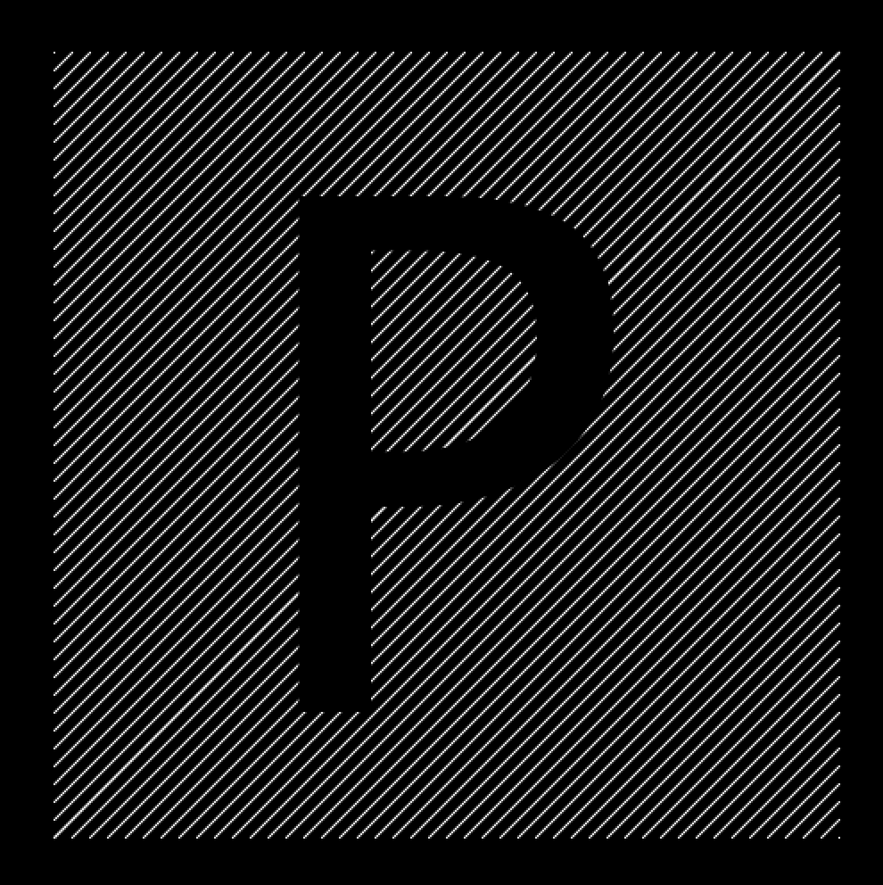

### Homework 2 (due Friday, February 5, 2016)

**This homework has two parts:** programming practice due **Friday**, and a required tutorial to be completed **before Sunday night**.

#### Array Tutorial (due Sunday)

Follow the [Processing Arrays tutorial](https://processing.org/tutorials/arrays/). Email me answers to the following questions to [jzamfirescupereira@cca.edu](mailto:jzamfirescupereira@cca.edu) by **Sunday night**.
  1. When is an array useful? (Answer in 3-4 sentences, please!)
  
  2. Consider the following code:
    ```processing
    int[] data; // Declare

    void setup() {
      size(100, 100);
      data = new int[5]; // Create
      data[0] = 19; // Assign
      data[1] = 40;
      data[2] = 75;
      data[3] = 76;
      data[4] = 90;
    }
    ```
    How many entries are there in the `data` array?
    
  3. Consider the following code:
    ```processing
    int[] data1 = { 19, 40, 75, 76, 90 };
    int[] data2 = { 19, 40 };
    int[] data3 = new int[127];
    ```
    What is the value of `data1[3]`?
    

#### Programming Practice (due Friday)

- **Assignment: Take a look at and run [this Triangle code](triangles.pde). Replace the repeating blocks of code with a loop, like exercise #2 we did in class.** Create a new [GitHub repository](../github-guide.md#to-create-a-new-repository) called `week-2` for this week's homework, and put your code into a new file called `triangles.pde`.

- **Assignment: Pick 5 of the 15 sketches below and recreate them; at least one must be animated.** Bonus points for adding flourishes to your sketches. In the `week-2` repository you just made above, create a new file for each of your five sketches -- include the sketch number in the file name. Email a link to your repository to [jzamfirescupereira@cca.edu](mailto:jzamfirescupereira@cca.edu) by **Friday, February 5**.

- Not all these sketches are equally difficult -- in fact some are very challenging!

- You may find the following [Processing tutorials](https://processing.org/tutorials/) helpful:
  - The [Processing Overview](https://processing.org/tutorials/overview)
  - [Coordinate System and Shapes](https://processing.org/tutorials/drawing)
  - [Color](https://processing.org/tutorials/color)

- It may also help to read through the [Processing reference](http://processing.org/reference/) to understand all the various functions available to you.

- For extra programming help, consider following the [Khan Academy programming tutorials using Processing](https://www.khanacademy.org/computing/computer-programming/programming).

Without further ado, here are the sketches:

1. Circles in a diagonal line. Use a while loop to draw the balls in sequence. What do you know about the x and y coordinates of each ball? (Spoiler: They're the same!)
   
   

2. Circles in a grid. You will likely need a while loop inside another while loop!
   
   

3. Colored circles in a grid, random version. Check out the `colorMode` function, and HSB, in the [Processing reference](http://processing.org/reference).
   
   

4. Colored circles in a grid, sequential version. Check out the `colorMode` function, and HSB, in the [Processing reference](http://processing.org/reference). Note that the colors shift from left to right *and* from top to bottom!

   

5. Circles in an triangle.

   
   
6. Circles in an hourglass.

   

7. The grid.
   
   
   
8. Diagonal lines.

   

9. Diagonal lines, interrupted.

   

10. Random bars.

   

11. Random bars, animated.

   [](http://youtu.be/EA9MqlY56LM)

12. Animated bars, mouse-sensitive. Check out the Processing-defined variables `mouseX` and `mouseY` in the [Processing reference](http://processing.org/reference).

   [](http://youtu.be/3OAKqXS5Lkw)

13. Bouncing balls, just two.

   [](http://youtu.be/7sfC4-4VoM4)

14. **Challenge:** Bouncing balls, more added by clicking. You may need to use an `Array` or two.

   [](http://youtu.be/Tnkhya3Tqu0)

15. **Challenge:** Fireworks! They should track the mouse and appear on clicks.

   [](http://youtu.be/yNTUEe9cof8)
   
