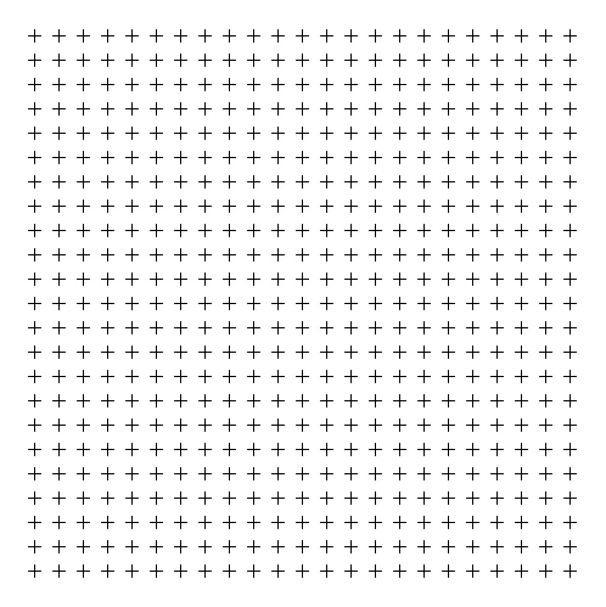
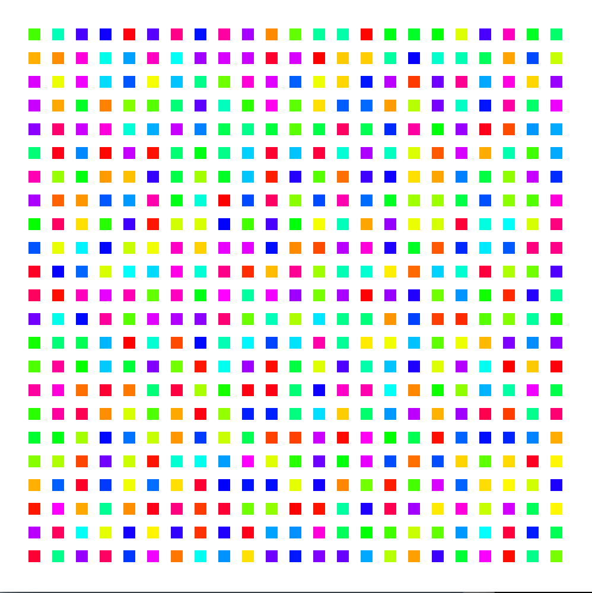
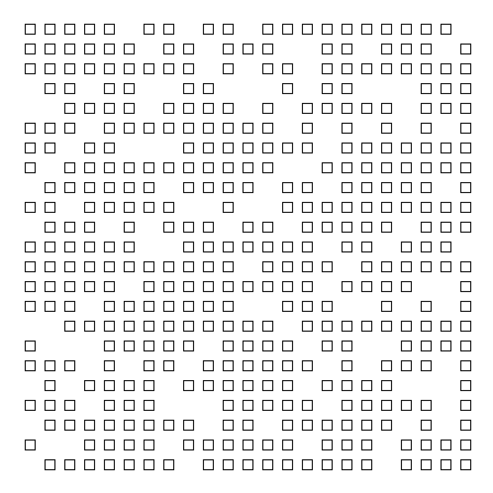
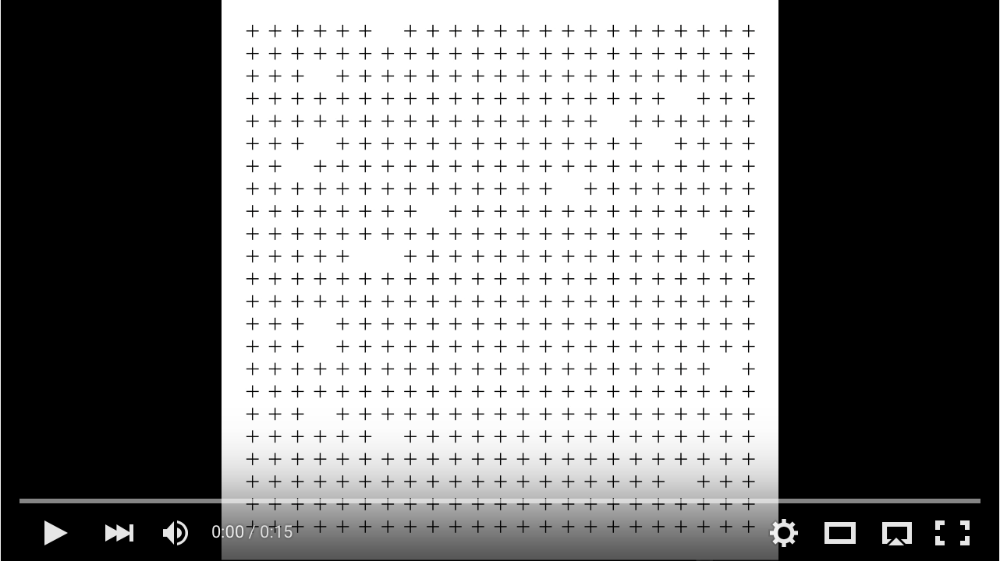
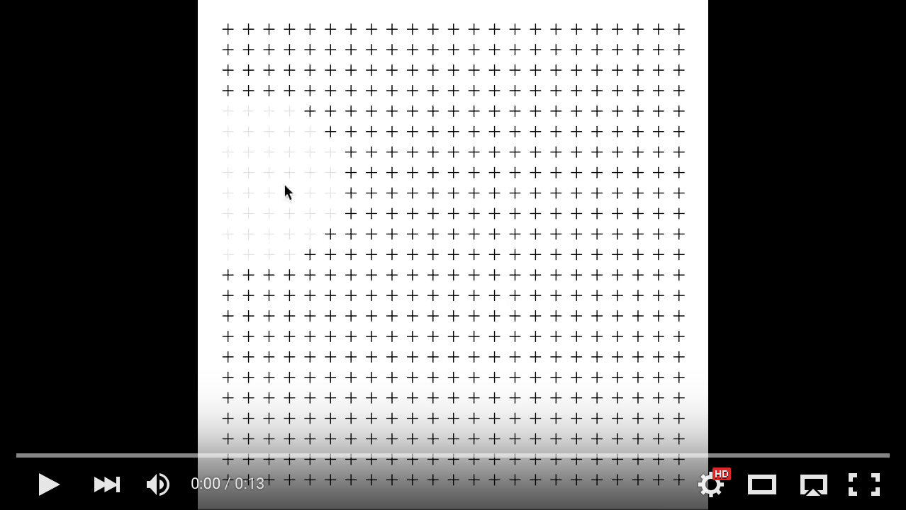

### Homework 3 (due Friday, February 12, 2016)

This homework consists solely of programming practice. Create a new [GitHub repository](../github-guide.md#to-create-a-new-repository) and send me the link. Each assignment below should be in its own plain text file with the file extension **.pde**.

Beginning with this assignment, create a debug log in your assignment repository. Every time you run in to unexpected behavior in your homework (a bug, a component that works differently than you thought, or something else), make an entry in your log. Describe the following:
  
   1. In a sentence, explain the behavior you expected. (E.g., "I expected the code to draw 24 lines.")
   2. In a sentence, explain the observed behavior. (E.g., "The code draws 21 lines.")
   3. Formulate a hypothesis about what might be causing the mismatch: what part of your code or what part of your circuit is behaving in a way you don't expect? (E.g., "The while loop condition checks that the counter variable is below a value that’s too high.")
   4. Test your hypothesis: what action can you take you determine if your hypothesis is true? (E.g., "Lower the loop condition counter variable comparison value.")
   5. Was your hypothesis confirmed? If so, fix the issue — sometimes this is done automatically by the hypothesis testing, but sometimes your test reveals deeper problems in the code. If your hypothesis was not confirmed, repeat with a new hypothesis!
   
This is a non-trivial bit of work, but it will help you develop very critical skills in debugging; if there is only one valuable thing you take from this class, it will be this ability. Don't skimp on it!

Remember, it is possible to know what everything in your code does. Every command has a defined result. If you don't know what something does, look it up in the reference, or ask someone like Leah or me! Code, especially the relatively short bits we're writing in class, has *deterministic* behavior: it is possible to predict, with extremely high accuracy, what any given bit code will do. **Debugging always begins with understanding what your code does, and why it doesn't do what you think it does!**

  - **Assignment**: Recreate the following five sketches:
  
  1. A grid of crosses.
  
    
  
  2. A grid of colored squares.
  
    
  
  3. An incomplete grid of squares. Missing squares are in [random](https://processing.org/reference/random_.html) positions.
  
    
  
  4. An animated, incomplete grid of crosses.
  
    [](https://youtu.be/rmJYfu0DesQ)
  
  5. An animated, grid-of-crosses spotlight that [tracks](https://processing.org/reference/mouseX.html) the [mouse](https://processing.org/reference/mouseY.html).
  
    [](https://youtu.be/6xtiqVWHpH4)

  - **Assignment**: Pick two additional sketches from [last week's list of 15](week2.md) and create them in Processing. Put each in a separate file.
  
  - **Assignment**: Pick one sketch you wrote for homework 2 and improve it in some way: cleaner code, less redundancy, etc.
  
  - Read through and understand the following code from the [array tutorial](https://processing.org/tutorials/arrays/) you read last week: 
    
    ```processing
    int num = 50;
    int[] x = new int[num];
    int[] y = new int[num];

    void setup() { 
      size(100, 100);
      noStroke();
      fill(255, 102);
    }

    void draw() {
      background(0);
      // Shift the values to the right
      for (int i = num-1; i > 0; i--) {
        x[i] = x[i-1];
        y[i] = y[i-1];
      }
      // Add the new values to the beginning of the array
      x[0] = mouseX;
      y[0] = mouseY;
      // Draw the circles
      for (int i = 0; i < num; i++) {
        ellipse(x[i], y[i], i/2.0, i/2.0);
      }
    }
    ```
    
    **Assignment**: Modify the code so that it draws a single continuous line connecting each circle, instead of drawing individual circles. Bonus points if the line fades to black as it trails away from the mouse.