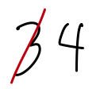

### Homework 4 (due Friday, February 19, 2016)

1. **Assignment:** Trace the code in [this pdf](https://github.com/zamfi/cca-programming-electronics-spring-2016/blob/master/hw/tracer-homework.pdf?raw=true) as though you are the computer, like we did in class.
   1. For each new variable, add a new entry to the Computer Memory table.
   2. For every change in a variable's value, update the entry in the table, legibly crossing out the old value, like this update from 3 to 4:

      
   3. For every drawing command, draw the result on the canvas. (This exercise is all monochrome.)
   4. Tally (or draw a line or dot) to the left of each line as you evaluate it. (Some lines will be evaluated many times!)
   5. Scan & email the printed exercise sheet to [me](mailto:jzamfirescupereira@cca.edu) and bring the original with you to class.

2. Create a new [GitHub repository](../github-guide.md) called `week4` for this week's assignment. You should have 4 files in that repository, one for each of the following 4 assignments:

   1. **Assignment**: *Debugging practice.* Consider the following code:
      ```processing
      final int GRID_SIZE = 10;
      final float GRID_PADDING = 50;

      void setup() {
        size(500, 500);
        mouseX = mouseY = 250;
      }

      float gridToCoordinates(int input) {
        return GRID_PADDING+input*(500 - 2*GRID_PADDING)/(GRID_SIZE-1);
      }

      void draw() {
        background(0);

        noStroke();
        fill(255);
        for (int i = 0; i < GRID_SIZE; ++i) {
          for (int j = 0; j < GRID_SIZE; ++j) {
            float distance = sqrt(pow(mouseX-gridToCoordinates(i), 2) + pow(mouseY-gridToCoordinates(j), 2));
            float ellipseSize = min(100, 1000.0/distance);
            ellipse(gridToCoordinates(i), gridToCoordinates(j), ellipseSize, ellipseSize);
          }
        }
      }
      ```
      
      As it stands, the circle closest to the mouse grows so large that is overlaps with neighboring circles. **Modify the code so that the circles just touch instead.** Save your code as `circles.pde` in your homework repository.

   2. **Assignment**: `println` practice. Consider the following code:
      ```processing
      size(400, 400);
      background(255);

      for (int x = 0; x <= width; x += 10) {
        for (int y = 0; y <= height; y += 10) {
          float dx = 7*(1-2.0*x/width);
          float dy = 7*(1-2.0*y/height);
          line(x, y, x+dx, y+dy);
        }
      }
      ```

      Add `println` statements to the code above to answer the following questions:
      1. How many times does `line` get caled? (Feel free to add a counter variable.)
      2. How many lines are perfectly horizontal? (Feel free to add an if statement around your previous counter increment. And remember: a perfectly horizontal line is one in which the y-coordinates of the start and end point are the same!)
      3. How many lines are perfectly vertical?
      
      Save your modified code with all printlns and answers to the questions above in a `// comment` to a file called `lines.pde` in your homework repository.

   2. **Assignment**: `println` practice (with arrays!). Consider the following code:
      ```processing
      int[] x;
      int[] count;

      void setup() {
        size(500, 500);

        x = new int[height];
        count = new int[height];
        for (int i = 0; i < height; i++) {
          count[i] = 30;
        }
      }

      void draw() {
        background(255);
  
        for (int i = 0; i < height; i++) {
          if (count[i] < 30) {
            if (count[i] < 15) {
              line(x[i], i, x[i] + count[i]*10, i);
            } else {
              line(x[i] + (count[i] - 15)*10, i, x[i] + 150, i);
            }
          }
          count[i]++;
        }
  
        if (mousePressed) {
          x[mouseY] = mouseX;
          count[mouseY] = 0;
        }
      }
      ```
      
      Click around the canvas to observe behavior. Then, add `println` statements to the above code to answer the following questions:
      1. What is the highest possible value assigned to any slot of the `count` array by the code above?
      2. For a given "stroke" -- the line that animates in growth and shrinkage when you click -- what is the length of the fifth drawn segment?
      
      Save your modified code with all printlns and answers to the questions above in a `// comment` to a file called `blips.pde` in your homework repository.

   3. **Assignment**: More `println` practice with arrays. Consider the following code:
      ```processing
      float[] values;
      int index;

      void setup() {
        size(600, 250);
        background(0);
  
        values = new float[width/3];
        index = 0;
      }

      float maybeRandomHeight() {
        if (random(10) < 1) {
          return random(height/3, 2*height/3);
        } else {
          return 0;
        }
      }

      void draw() {
        background(255);

        values[index] = maybeRandomHeight();
        index = index + 1;
        if (index >= values.length) {
          index = 0;
        }

        for (int i = 0; i < values.length; ++i) {
          int realIndex = index + i;
          if (realIndex >= values.length) {
            realIndex -= values.length;
          }
          line(i*3, height-values[realIndex], i*3, height);
        }
      }
      ```
      
      Use `println` to answer the following questions:
      1. What's the highest value you observe for variable `realIndex`? Lowest?
      2. In 10 seconds, how often is the variable `index` reset to 0? Consider using the [millis](http://processing.org/reference/millis_.html) function to help you with timing.
      
      Save your modified code with all printlns and answers to the questions above in a `// comment` to a file called `flappy.pde` in your homework repository.
      