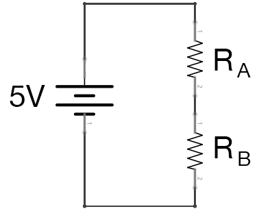

### Homework 7 (due Sunday, March 13, 2016)

This assignment consists of an Arduino lab, tutorial, and a programming practice assignment, all due Sunday.

#### Arduino Lab

- **Assignment:** Complete the [Exploring Signals lab](http://workshopweekend.net/arduino/labs/exploring-signals). There are two parts; complete each part on "half" of your breadboard. The images all show a half size breadboard -- your breadboard is full size: two half size breadboards stuck together! No need to do the challenges, but you are free to if you like.
  
  You'll need extra parts for this lab: LEDs, wires, two light-dependent resistors (LDR), and two 10K resistors, all of which you can get from the Hybrid Lab. (If you can, do this assignment at the Hybrid Lab!)
  
  **Upload your final code to [a GitHub repository called `week7`](../github-guide.md) and email a link to [jzamfirescupereira@cca.edu](mailto:jzamfirescupereira@cca.edu). Bring your breadboard with your completed project to Wednesday's class.**

- **Assignment:** Read [this tutorial about Ohm's Law](http://www.physicsclassroom.com/class/circuits/Lesson-3/Ohm-s-Law) and answer the following questions in your `week7` github repository's `README.md` file.
  
  Consider the circuit below.
    
  
  
  The two resistors are said to be connected "in series". That means that any charge particles flowing through the circuit first pass through one resistor (*RA*), and then the other resistor (*RB*).
  
  Because all charge particles in a series circuit flow through both resistors, we know the current must be the same in both resistors. We also can deduce that the charge particles lose all their voltage going through the two resistors, and so they must lose some amount of voltage in *RA* -- call that amount *VA* -- and some amount in *RB* -- call that amount *VB*. In a series circuit, the voltages add together, so *VA + VB = 5V*. This means that the resistances add together too, and the **equivalent resistance** for the circuit is *RA + RB*.
  
  This makes is easy to calculate the total current, *I = 5V / (RA + RB)*

  **Question 1: Assume *RA* and *RB* are each equal to *10000 Ω*. What are the total resistance and total current in the circuit?**
  
  **Question 2: Assume *RA = 10000 Ω* and *RB = 5000 Ω*. What are the total resistance and total current in the circuit?**

  For each resistor, *V = I ⨉ R*. So *VA = I ⨉ RA* and *VB = I ⨉ RB*.
  
  **Question 3: Assume *RA = 10000 Ω* and *RB = 5000 Ω*. How much voltage is lost through resistor *RA*? And *RB*?**
  
  *Note:* If you need to review your algebra, I recommend the [Khan Academy tutorials on the topic](https://www.khanacademy.org/math/algebra)!

#### Programming Practice

- Let a thousand colors bloom!
  
  Modify the [thousand-bouncing-circles code](thousands.pde) we wrote in class to make each circle its own color. You may need to add a new variable to the `Ball` class.
  
  **Bonus points**: modify the display() function to draw something other than a circle: a flower, perhaps?
  
  **Assignment:** Upload your code to your `week7` repository and email me the link.